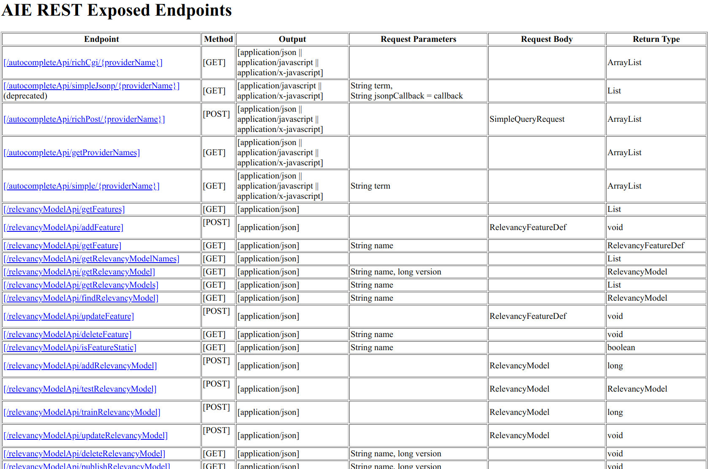

# Search UI - Configuring a Servlet for Attivio REST API Access
This document describes how you can use the servlet that comes with the Search UI to provide SAML-based SSO-protected access to the Attivio server's REST APIs. This is useful if you are writing your own UI application and need to access the Attivio REST APIs directly from JavaScript code running in the user's browser. Note that this is not needed if you are writing your own application based on Search UI and SUIT (in which case the existing servlet configuration will work—see [Configuring SAML-Based SSO](ConfiguringSSO.md)) or if your application will make calls to the Attivio REST APIs from its server (in which case, you should use the usual means of connecting to Attivio, with a username/password or an API key, depending on your installation (see [Deploying to Tomcat](DeploymentTomcat.md)).

We recommend that you use the utility class `FetchUtils`, available at https://github.com/attivio/fetch-utils, to make calls from your application's JavaScript code to the Attivio REST APIs via the servlet. See the `README.md` file there for documentation how this class works.

You will need to do the following steps to set up the SAML authentication:

1. Configure the Search UI servlet to run in a servlet container such as Tomcat.
2. Configure the same SAML IdP you are using for your application to also know about the Search UI application.
3. Set up a public/private key pair to be used when encrypting messages sent to the IdP
4. Configure the servlet to know you are using SAML.
5. Configure the servlet to know if you are behind a reverse proxy or load balancer.
6. Configure CORS access, if needed.
7. If desired, disable serving of the Search UI application by the servlet.
8. Test your configuration.

## Steps 1-5

Please see the corresponding instructions in [Configuring SAML-Based SSO](ConfiguringSSO.md) for details on steps 1, 2, 3, 4, and 5 above. Everything in that file also applies here.

## Step 6: Configuring CORS

If you are using a reverse proxy or other server in front of the servlet, it's possible to configure CORS access there. If not, you can configure CORS access to the servlet in `application.properties`. To do so, set the property `suit.attivio.corsOrigins` with the value of the allowed domain. This should include the protocol, hostname, and port (e.g. "https://myapp.mycompany.com:443"). If there is more than one domain you need to allow, you can have multiple values separated with commas.

## Step 7: Disabling the Search UI

If you want to prevent the Search UI servlet from serving the Search UI web application, you can do so using the `suit.attivio.serveSearchUI` property in `application.properties`. If you set the value to `false`, the Search UI application will no longer be served.

## Step 8: Test the Configuration

Once you have completed the above steps and restarted the web server, use a browser to access the URL of the Search UI with the following path: `/rest` (for example, if your servlet is running at port 8080 on myservlet.mycompany.com and you haven't changed the name of the application, you would go to `https:myservlet.mycompany.com:8443/searchui/rest`). You will be redirected to the Identity Provider's login form. After logging in, you should see the "AIE REST Exposed Endpoints" page:

### Logging Information

See [Configuring SAML-Based SSO](ConfiguringSSO.md) for information about logging in the servlet.
