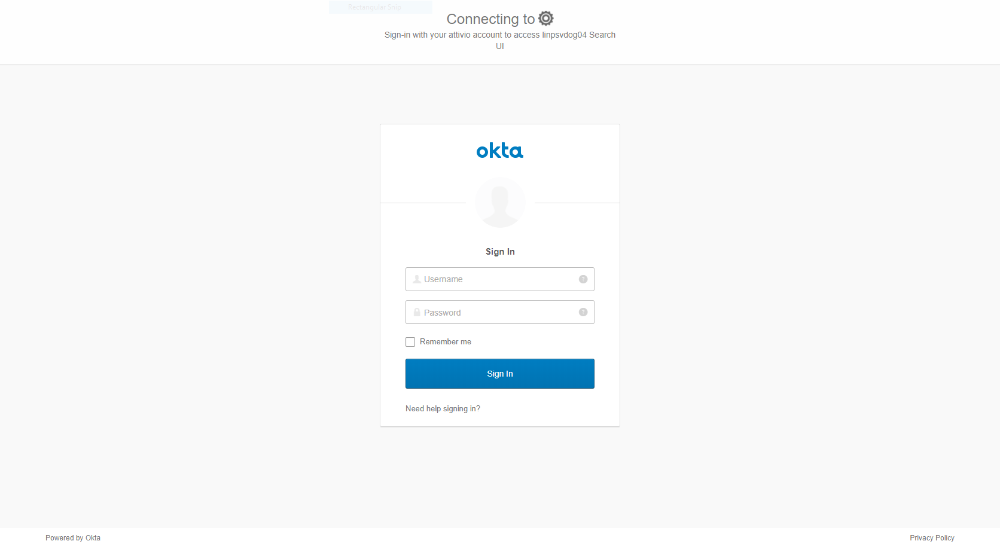
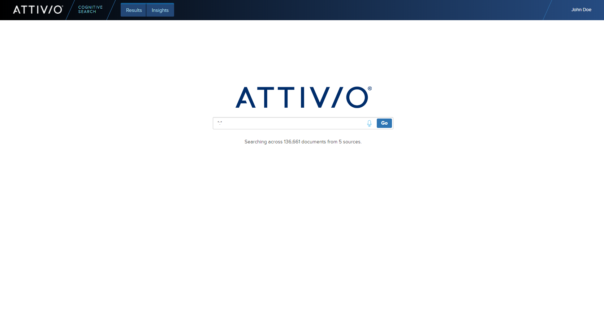

# Search UI - Configuring SSO
Search UI supports Single Sign-on (SSO) using any SAML 2.0 Identity Provider. SAML (Security Assertion Markup Language) is an XML-based standard for securely exchanging authentication and authorization information between entities — specifically between identity providers (IdPs), service providers, and users. Well-known IdPs include ADFS, Okta, and Azure AD among others. See https://en.wikipedia.org/wiki/SAML_2.0 for more information.

Configuring Search UI to work with your Identity Provider involves a few simple steps outlined below.

## Step 1 - Create an application in the Identity Provider
You must define the application for which you want to implement SSO in the IdP. For example, in Okta, this is done by executing the following steps. Configuring other IdPs will require a similar process.

1. Click on **Admin**, then **Add Applications**
2. Click **Create New App**, select **Web** for your platform, choose **SAML 2.0** for Sign-on method, and click **Create**
3. Give your app a name and click **Next**
4. Fill in **Single sign on URL** with `https://<your deployment URL and port>/saml/SSO`
5. Fill in **Audience URI** with a unique identifier such as `suitback` or with the same value as **Single sign on URL**
6. Create the following entries under the **ATTRIBUTE STATEMENTS** section:

| Name | Name format | Value |
| --- | --- | --- |
| FirstName |	Unspecified |	user.firstName |
| LastName | Unspecified | user.lastName |
| EmailAddress | Unspecified | user.email |
| UserID | Unspecified | user.login |

**Note**: If your project has [Content Security](https://answers.attivio.com/display/extranettrunk/Content+Security) enabled, it is important to map the `UserID` to the same field used as the `principalId` when ingesting the User documents (Principals).

7. The rest of the fields can be left with default values, click **Next**
8. Select **"I'm an Okta customer adding an internal app"**
9. Check **"This is an internal app that we have created"**
10. Click **Finish**
11. On the subsequent **Sign On** tab, click the **Identity Provider metadata** link to download the metadata XML file. We will need to copy this file to the web server and reference its location in the next step.

## Step 2 - Configure Search UI SSO settings
Once you have configured the Identity Provider and have exported the metadata XML file, execute the following steps to configure Search UI to work with the IdP.

1. Generate a public/private key pair to use to be used for signing outgoing requests. The following command does not have to be executed on any specific server. Transfer the generated files to the web server to be referenced in the next steps.
```
# KEY AND CERT
openssl genrsa -out localhost.key 2048
openssl req -new -x509 -key localhost.key -out localhost.pem -days 3650 -subj /CN=localhost
# PEM KEY to DER
openssl pkcs8 -topk8 -inform PEM -outform DER -in  localhost.key -out  localhost.key.der -nocrypt
```
The above commands will produce 3 files: `localhost.key`, `localhost.key.der` and `localhost.pem`. Transfer `localhost.key.der` and `localhost.pem`to the web server. We will reference their location below.
2. Edit `configuration.properties.js` to set authType to `SAML`
3. Edit `application.properties` that you created when you [deployed Search UI to Tomcat](DeploymentTomcat.md) to set the following properties. These must match the configuration of the Identity Provider. 
```
security.saml.entityId=suitback
security.saml.metadataLocations=file:/opt/tomcat/ssl/metadata.xml
security.saml.keyDerLocation=file:/opt/tomcat/ssl/localhost.key.der
security.saml.keyPemLocation=file:/opt/tomcat/ssl/localhost.pem
```
**Note**: If integrating with Azure AD and see `The SAML authentication request property 'Scoping/ProxyCount' is not supported.` on the login page, add the following to the `application.properties` file:
```
saml.sso.profile-options.include-scoping=false 
```
4. Save the changes to `application.properties` and restart the web server.

## Step 3 - Test logging in
Once you have completed the above steps and restarted the web server, access the URL of the Search UI. You will be redirected to the Identity Provider's login form. 



After submitting your credentials, the Identity Provider will authenticate you and redirect back to Search UI. You will be logged in and your name will appear in the upper right corner.


