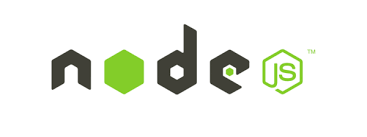

## Overview
To build your own search application using the SUIT library, with any or all of the features Search UI provides, we strongly recommend that you fork the searchui repository, from Attivio's public GitHub. You can modify and extend your application starting from the baseline functionality that Search UI provides. We encourage you to submit your extensions back to the GitHub repository when finished. See [below](#contribute) for details.

## Prerequisites/Environment Setup
| Prerequisite | Description |
| ---- | ---- |
|  | To get started developing with SUIT, you must have Git installed. Development can be done on Windows, Unix/Linux or Mac. [Download](https://git-scm.com/downloads) and run the appropriate installer for your operating system to install Git. In order to access and fork the project, you'll also need a [GitHub account](https://github.com/join). | 
|  | Maven is used to install and build Search UI for deployment. You need to have at least version 3.5 of Maven installed. See their [project’s page](https://maven.apache.org/) for information on installing it if necessary. |
|  | Node.js is required for developing locally. You need to have at least version 6.11 installed. See https://nodejs.org/en/ for information on installing it if necessary. |

## Fork and Clone searchui Repo
A *fork* is a copy of a repository. Forking a repository allows you to freely experiment with changes without affecting the original project.

Forking the searchui repo is a simple two-step process:
1. On GitHub, navigate to the [attivio/searchui](https://github.com/attivio/searchui) repository.
2. In the top-right corner of the page, click **Fork**. Select the destination for the forked project.

That's it! Now, you have a fork of the original **attivio/searchui** repository.

See https://help.github.com/articles/fork-a-repo/ for more information about forking projects and keeping in sync with changes made to the original project.

### Create a local clone of your fork
Right now, you have a fork of the Search UI repository, but you don't have the files in that repository on your computer. Let's create a *clone* of your fork locally on your computer.

1. On GitHub, navigate to your fork of the searchui repository.
2. Under the repository name, click **Clone** or download**.
3. In the **Clone with HTTPs section**, click to copy the clone URL for the repository.
4. Open a terminal (or Git Bash on Windows)
5. Type `git clone`, and then paste the URL you copied in Step 2. It will look like this, with your GitHub username instead of YOUR-USERNAME:
```
git clone https://github.com/YOUR-USERNAME/searchui
```
6. Press **ENTER**. Your local clone will be created.
```
$ git clone https://github.com/YOUR-USERNAME/searchui.git
Cloning into 'searchui'...
remote: Counting objects: 998, done.
remote: Compressing objects: 100% (805/805), done.
remote: Total 998 (delta 163), reused 981 (delta 152), pack-reused 0
Receiving objects: 100% (998/998), 5.80 MiB | 4.83 MiB/s, done.
Resolving deltas: 100% (163/163), done.
Checking out files: 100% (876/876), done.
```

Now, you have a local copy of your fork of the Search UI repository!

### Configure Git to sync your fork with the original Search UI repository
When you fork a project and wish to propose changes to the original repository, you can configure Git to pull changes from the original, or *upstream*, repository into the local clone of your fork.

1. On GitHub, navigate to your fork of the searchui repository.
2. Under the repository name, click **Clone or download**.
3. In the **Clone with HTTPs section**, click to copy the clone URL for the repository.
4. Open a terminal (or Git Bash on Windows)
5. Change directories to the location of the fork you cloned in the above section.
6. Type `git remote -v` and press **Enter**. You'll see the current configured remote repository for your fork.
```
$ git remote -v
origin  https://github.com/YOUR-USERNAME/searchui.git (fetch)
origin  https://github.com/YOUR-USERNAME/searchui.git (push) 
```
7. Type `git remote add upstream` and then paste the URL you copied in Step 2 and press **Enter**. It will look like this:
```
$ git remote add upstream https://github.com/attivio/searchui.git
```
8. To verify the new upstream repository you've specified for your fork, type `git remote -v`again. You should see the URL for your fork as origin, and the URL for the original repository as **upstream**.
```
$ git remote -v
origin  https://github.com/YOUR-USERNAME/searchui.git (fetch)
origin  https://github.com/YOUR-USERNAME/searchui.git (push)
upstream  https://github.com/attivio/searchui.git (fetch)
upstream  https://github.com/attivio/searchui.git (push) 
```

Now, you can keep your fork synced with the upstream repository with a few Git commands. For more information, see "[Syncing a fork.](https://help.github.com/articles/syncing-a-fork)"

## Building and running the application
### Maven Install
The entire Search UI project is set up to be built using Apache Maven. After you've cloned your repo, simply run `mvn clean install` from your terminal or command window, in the top-level searchui directory. Maven will build all of the three sub-projects:

* **searchui-frontend** - Builds the actual JavaScript code for the web application. You'll likely spend the 
* **searchui-server** - builds the servlet that can be used to host the Search UI application in a servlet container such as Apache Tomcat
* **searchui-module** - builds an Attivio module that can be installed into your Attivio Platform to host the Search UI from the Attivio node servers.
```
mvn clean install
```

### Configuration
There are a few important configurations you'll need to set for development and/or deployment. See [How Do I Configure the Search UI?](README.md#how-do-i-configure-searchui) for information on how to configure the various properties.

### Development Mode
While developing your application, you'll want to see the effects of your changes immediately rather than relying on Maven builds producing artifacts that you can deploy. Fortunately, Node.js provides a convenient way to do this.

See the **searchui-frontend**'s [Developer's Guide](searchui-frontend/Developing.MD) for instructions.

### Deployment Mode
When you are ready to deploy your application to a particular environment, such as QA or PROD, run `mvn clean install` once again. The following artifacts will be produced:

| Artifact | Purpose |
| --- | --- |
| searchui/searchui-server/target/searchui-server-0.0.1-SNAPSHOT.war | WAR file to be deployed to web server, outside of Attivio, such as Tomcat. See [Search UI - Deploying to Tomcat](DeploymentTomcat.md) for more information. |
| searchui/searchui-module/target/searchui-module-0.0.1-SNAPSHOT-dist.zip | External module to be deployed within the Attivio Admin UI. <!-- See the installation instructions on [Search UI Download](https://answers.attivio.com/display/extranet55/Search+UI+Download) to deploy your application as an alternative to the download available on that page. --> |

## Contribute
If you extend Search UI with a new feature or improve it in any way, we'd love to know about and possibly pull your changes into the original project for others to enjoy. If you are hoping to contribute back to the original repository, you can send a request to us to pull your fork into our repository by submitting a [pull request](https://help.github.com/articles/about-pull-requests).
