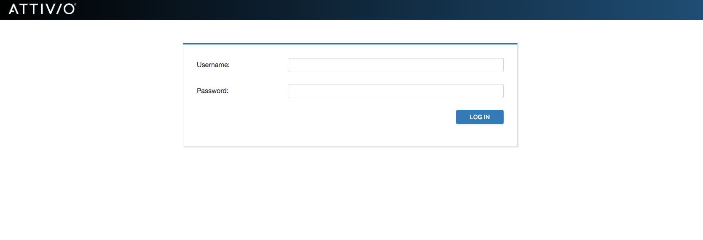

## Table of Contents
* [Overview](#overview)
* [Project Organization](#project-organization)
* [What is SUIT?](#what-is-suit)
* [Installation and Deployment](#installation-and-deployment)
* [How Can I Customize the Search UI?](#how-can-i-customize-the-search-ui)
* [Security](#security)
* [Cognitive Search](#cognitive-search)
* [Ask a Question](#ask-a-question)
* [360&deg; View](#360-view)
* [Insights](#insights)
* [How Do I Configure Search UI?](#how-do-i-configure-search-ui)
* [Supported Browsers](#supported-browsers)
* [Contributing](#contributing)

## Overview
The Attivio **Search UI** is an application built on top of Attivio’s Search UI Toolkit, or **SUIT**. The SUIT library is available in a [separate repository](https://github.com/attivio/suit) and via NPM (see “What is SUIT?” below for more details).

The Attivio Search UI allows you to search across and view the data in the index of your Attivio, Elasticsearch, or Solr installation. You can use it as-is, you can customize it to meet your needs, or you can use it as the starting point when creating your own search-centered application.

## Using Search UI
If you are interested in how to use the Search UI application as an end-user, see [Using the Search UI](UsingSearchUI.md). The remainder of the current README file deals with deploying and customizing the Search UI application.

## Project Organization
The Attivio Search UI is a web application written in JavaScript and based on the [React](https://reactjs.org) project. It runs entirely in the user’s browser. The code for the web application is in the [**frontend**](https://github.com/attivio/searchui/tree/master/frontend) directory of the repository and consists of application-level code for searching the index including the definition of the pages in the application and the logic of how they’re connected. The application-level code is relatively minimal, merely dictating how the components (defined in the SUIT library mentioned above) are laid out and condfigured; the bulk of the code that implements the application is in the SUIT library itself.

The repository also contains two additional components that allow hosting of the Search UI web application, either on one or more Attivio node servers as a module ([**module**](https://github.com/attivio/searchui/tree/master/module)) or in a servlet container such as Apache Tomcat ([**servlet**](https://github.com/attivio/searchui/tree/master/servlet)). The functionality of the Search UI application varies slightly depending on how it is hosted and configured, as described below.

## What is the SUIT Library?

The individual UI elements that make up the Search UI application are defined in the SUIT library. These include more basic components such as pop-up menus and text fields as well as more complex components such as one that renders an entire document from the index or one that knows how to take the search criteria provided by the user and perform a search of the index. In addition to UI components, SUIT contains a number of API and utility classes which facilitate the interactions between the UI and the back-end server. See the [GitHub repository](https://github.com/attivio/suit) for the SUIT library for detailed documentation on its components and other functionality.

## Installation and Deployment of Search UI
As was alluded to in discussing the organization of the Search UI repository, there are two options when deploying Search UI. It can be run “embedded,” hosted by the Attivio node server or it can be run “stand-alone,” hosted by a servlet container:

### Embedded

As a module in the Attivio project is the most straightforward way to deploy Search UI. When you do this, a link in the Attivio Administration UI will be created under the “Query” heading. This will open a new tab and take the user to the Search UI application. (The actual URL for Search UI will be the server’s name and port followed by `/searchui`, for example, `http://localhost:17000/searchui`.)

The Search UI module is included with the Attivio Platform installer. You can also obtain the latest build of the module on the [Attivio Answers](https://answers.attivio.com/display/extranet55/Search+UI+Download) website.

### Stand-alone(DeploymentTomcat.md)**

Stand-alone deployments are recommended when Search UI is used as the primary user interface in your production environment as this approach allows you to manage and scale the Search UI application separately from the Attivio nodes. If you require integration with a SAML-based identity provider (IdP) for single-sign-on authentication, you will need to perform a stand-alone deployment. (Of course, if you are using the Search UI application with a non-Attivio back end, then you have no chioice but to use the stand-alone method for deploying it since there will be no Attivio nodes.)

Stand-alone deployments can be done on the same host as Attivio nodes provided there are sufficient resources, though in many situations, dedicated Search UI hosts are recommended to decouple the two.

See the [stand-alone deployment documentation](DeploymentTomcat.md) for details on how to configure Apache Tomcat to host the Search UI application. (Although they are written specifically for Tomcat, they are generally useful for deploying to other servlet containers such as Jetty, GlassFish, JBoss, WebSphere, etc…)

For instructions on building the application for one of the above deployment options, or if, instead, you wish to customize and build your own application for either deployment option, see the [Developer’s Guide](DevelopersGuide.md) for instructions on setting up your development environment and building.

#### Using SSO for the Attivio REST APIs

If you are writing your own front-end search application that needs access to the Attivio REST APIs but you don't want to use Search UI and SUIT, you can leverage the Search UI servlet used when deploying to Tomcat in order to provide SAML-based access to these APIs. This prevents you from having to expose the credentials of the Attivio server in your JavaScript code. To learn more about how you can do this, see [Configuring REST SSO](ConfiguringRESTSSO.md).

## How Can I Customize the Search UI?

Depending on what you want to do with the Search UI, you can customize it in a few different ways. Many aspects of the application can be changed by editing the configuration (in `[configuration.properties.js](https://github.com/attivio/searchui/tree/master/frontend/configuration.properties.js)`). There are details of what you can change in the configuration in the [FAQ document](FAQ.md), as well as configuration file itself.

If you are deploying the application as an Attivio module, you can place your updated configuration file in your project’s `resources` directory. If you are deploying to a servlet container, the `application.properties` file should point to your custom configuration file.

To build your own search application using the SUIT library, with any or all of the features Search UI provides, see the [Developer’s Guide](DevelopersGuide.md).

---

## Security
Search UI can be configured to require users to log in. The options vary depending on your deployment type.

| Deployment Type | Security Options | 
| --------------- | ---------------- | 
| Embedded (within Attivio) | <ul><li>[Active Directory](https://answers.attivio.com/display/extranet55/Active+Directory+Authentication+Provider)</li><li>[XML](https://answers.attivio.com/display/extranet55/XML+Authentication+Provider)</li></ul> | 
| Stand-alone (i.e. Tomcat)	 | <ul><li>[SSO](ConfiguringSSO.md)</li><li>[XML](ConfiguringXMLAuthentication.md)</li></ul> | 

Depending on the security option, users will either be presented with Attivio login form or one presented by the Identity Provider.

 

## Cognitive Search
After logging in, if required, Search UI opens to its landing page. The landing page provides a clean UI to start your search investigation.

**On this page you can:**
* [Ask a question](#question)
* Click on [Insights](#insights) to better understand your data

## Ask a Question

Whether you want to ask a free-form question or use our [Advanced Query Language (AQL)](https://answers.attivio.com/display/extranet55/Advanced+Query+Language) in this page you can get to the information you need. Hit **ENTER** or click **Go** to see the results.

Following are some features of the results page:

| Feature | Description |
| ------- | ----------- |
| Logged-in user (Attivio Administrator in our case)    | The name of the logged-in user appears in the upper right corner, if available. Otherwise, the username is displayed with an option to log out. |
| Simple or Advanced Query Language    | Select between Attivio’s [Simple Query Language](https://answers.attivio.com/display/extranet55/Simple+Query+Language) or the [Advanced Query Language](https://answers.attivio.com/display/extranet55/Advanced+Query+Language). |
| Search Box   | Enter the text of your query.  For the [Simple Query Language](https://answers.attivio.com/display/extranet55/Simple+Query+Language), enter a keyword or a field:keyword pair.  The string \*:\* retrieves all documents in all tables.  You can paste in more complex queries written in the [Advanced Query Language](https://answers.attivio.com/display/extranet55/Advanced+Query+Language), such as those demonstrated in the [Quick Start Tutorial](https://answers.attivio.com/display/extranet55/Quick+Start+Tutorial). |
| Facet Filters    | The left column of the display is devoted to facet controls.  Each one summarizes opportunities to “drill down” on the set of current results to narrow the search. |
| Applied Facets    | Under the header, the facet filters that have been applied to the search are displayed. Each item can be individually removed to widen the result set as needed. |
| Sort Control    | The sort control reorders the result items. You can sort by relevancy and select which [relevancy model](https://answers.attivio.com/display/extranet55/Machine+Learning+Relevancy) to use, or by any sortable field in the schema. See [Sorting Results](https://answers.attivio.com/display/extranet55/Sorting+Results) for more information. |
| Relevancy Model    | If you choose Relevancy in the Sort Control, you can choose the Relevancy Model to use. See [Machine Learning Relevancy](https://answers.attivio.com/display/extranettrunk/Machine+Learning+Relevancy) for more information. |
| Paging Controls    | The paging controls let you page through the search results conveniently. |
| Matching Documents | The right column of this page is devoted to the display of matching documents. <ul><li>If there is a [Thumbnail Image](https://answers.attivio.com/display/extranet55/Thumbnail+and+Preview+Images) available, it will be displayed to the left of the document (like the flag images in the Quick Start Tutorial.)</li><li>The title of the document is often a hyperlink to the actual document or web page.</li><li>Search UI is preconfigured to show the **table** value of each matching document next to the result number.</li><li>By default, Search UI displays the document teaser, with matching terms [highlighted](https://answers.attivio.com/display/extranet55/Field+Expressions).<ul><li>Items that matched the query are shown in **bold** face.</li><li>[Scoped entities](https://answers.attivio.com/display/extranet55/Scope+Search) are color-coded:<ul><li>People: Yellow</li><li>Locations: Blue</li><li>Companies: Red</li></ul></li><li>[Key phrases](https://answers.attivio.com/display/extranet55/Key-Phrase+Extraction): Green</li><li>[Entity Sentiment](https://answers.attivio.com/display/extranet55/Using+Entity+Sentiment) is indicated by red and green plus or minus icons.</li></ul></li><li>Document Details consist of fields and values. Note that you can temporarily display all fields by setting the **Details** button next to the Sort Control to **On**.</li><li>The **Tags** field is a [Real Time Field](https://answers.attivio.com/display/extranet55/Real-Time+Updates) configured in the [Schema](https://answers.attivio.com/display/extranet55/Configure+the+Attivio+Schema). It lets you add labels to each document directly from the Results Page. These labels can then be collected into a new facet to assist in subsequent searches.</li></ul> |  
| User Rating    | A user can provide a rating for a document that can be used as a signal when using Machine Learning to create a relevancy model. See [Machine Learning Relevancy](https://answers.attivio.com/display/extranet55/Machine+Learning+Relevancy) for more information. |
| Show 360&deg; View | You can choose to see a  360&deg; view of a document to better understand the document and how it relates to other documents using our Knowledge Graph. |

---

## 360&deg; View

The 360&deg; View page allows you to take a closer look at a single document and understand how it relates to other documents in the index.

In the 360&deg; View you can see the document text, extracted entities and the Knowledge Graph. The Knowledge Graph shows how this document is linked to other documents by matching the entities extracted.

If we look at “Italy,” we can see it relates to two News documents based on mentions of the extracted locations of Italy and Germany.

---

## Insights
The Insights page provides a dashboard that allows you to quickly understand your data without knowing what data was ingested.

Using our [Text Analytics](https://answers.attivio.com/display/extranet55/Attivio+Text+Analytics) capabilities and [facets](https://answers.attivio.com/display/extranet55/Facets) we build knowledge on top of your data so that you can better understand your data.

---

## How Do I Configure Search UI?
Many Search UI features are configurable, including pointing it to an Elasticsearch or Solr installation.  These settings support rapid prototyping for demos and proof-of-concept projects.  

> Setting these preferences will affect all users who may be accessing this application.
> If any values are not specified, the application uses system-application defaults.
> If Search UI is deployed to multiple web servers or Attivio nodes, the preferences must be manually synchronized across all nodes.

The full list of properties and the description of each can be found in the [configuration.properties.js](frontend/configuration.properties.js) file.

## Supported Browsers
Search UI is tested with the following browsers at release time:

**Windows Clients:**

* Chrome stable - latest stable version
* Microsoft Edge - latest stable version
* Internet Explorer 11

**Mac clients:** 
* Chrome stable - latest stable version

**Linux clients:** 
* Chrome stable - latest stable version

**Recommended Screen Resolution:**
* 1280 x 800 pixels, 1600 x 900 pixels or higher

## Contributing
To report an issue or contribute, see [CONTRIBUTING.md](CONTRIBUTING.md)
